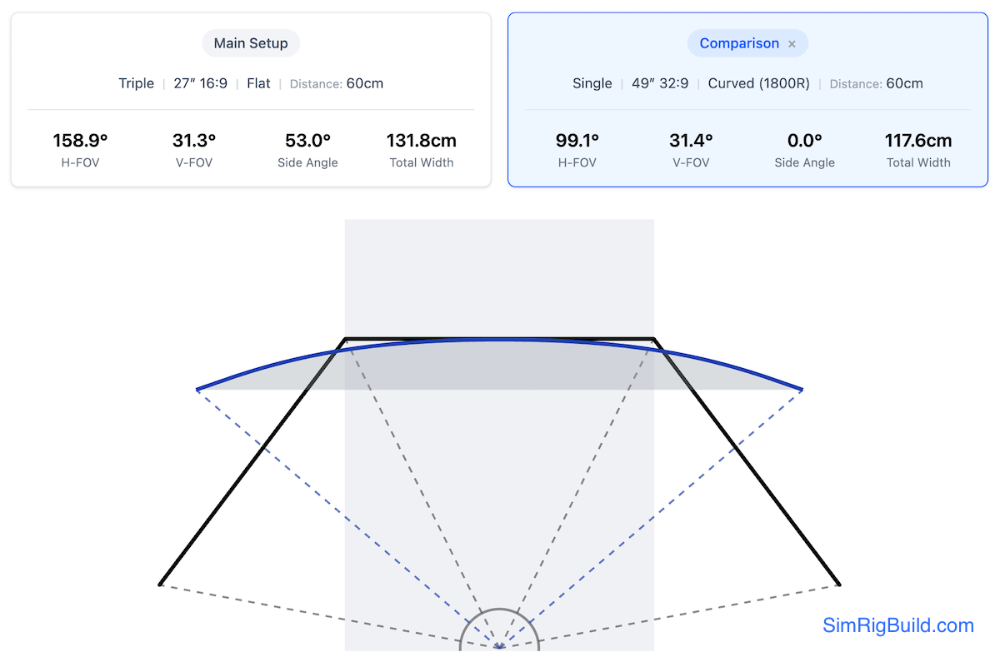

# SimRigBuild Screen Planner

Single and triple-screen FOV calculator and planner. Optimize screen placement, FOV settings, choose optimal screen
configurations and estimate required space for your triple-screen setup.

**[Try it out!](https://simrigbuild.com)**

## Purpose

SimRig Screen Planner helps you:

- Calculate proper screen positioning and angles for optimal immersion and in-game correction angles
- Compare different setup options before purchasing or mounting hardware
- Determine correct support arm angles
- Find the right FOV settings for your racing games
- Visualize how your setup will look from above

## Features

- **Monitor Configuration**

  - Screen sizes (17-77 inches)
  - Multiple aspect ratios (16:9, 21:9, 32:9)
  - Flat and curved screen support
  - Bezel compensation

- **Setup Visualization**

  - Interactive top-down view
  - Screen angle representation
  - Head position reference
  - Total space requirements

- **Racing Game Settings**
  - Horizontal and vertical FOV values
  - Side screen angle recommendations

## How to Use

1. Enter your screen specifications and viewing distance
2. Review the calculated angles and FOV values
3. Use angle measurements for physical mounting
4. Apply FOV values in your racing simulator settings
5. Compare different options by adjusting parameters

## Notes

All measurements are estimates to help with planning. Fine-tuning may be needed based on your specific hardware and preferences.

## Feedback

Found a bug or have suggestions? [Open an issue](https://github.com/anzax/simrig-screen-planner/issues) on GitHub.

## License

Licensed under the Apache License 2.0 - see the [LICENSE](LICENSE) file for details.

---

🏁 Crafted by a fellow sim racer for the [r/simracing](https://www.reddit.com/r/simracing/) community 🔥
